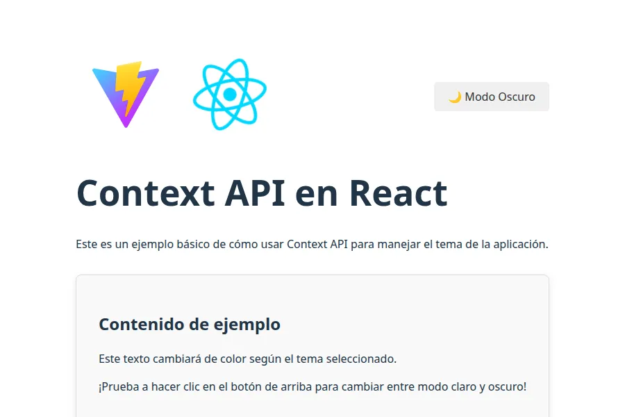
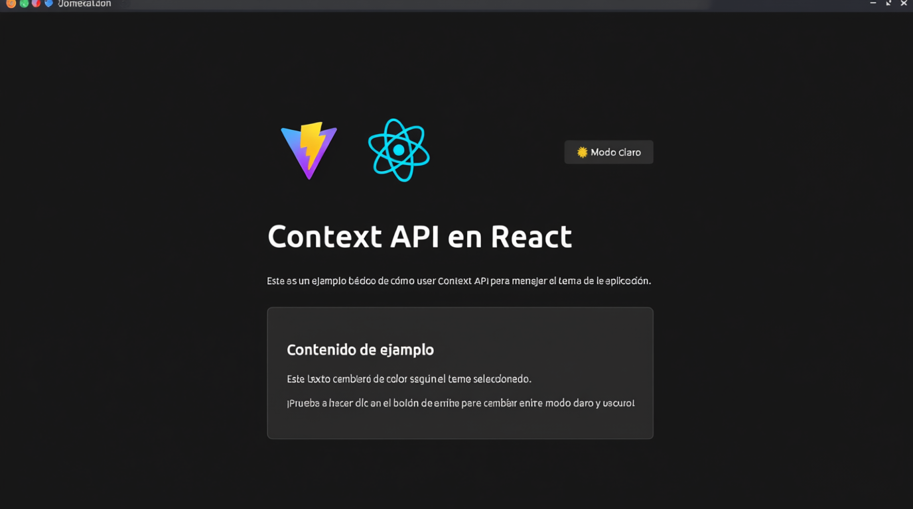

# React Context API - Práctica: Gestión de Tema (Claro/Oscuro)

Este proyecto es una aplicación React que demuestra el uso de la Context API para implementar un sistema de gestión de temas (claro/oscuro) a nivel global en la aplicación. La solución incluye persistencia del tema seleccionado en el almacenamiento local del navegador y detección de la preferencia de tema del sistema operativo.

## 🚀 Tecnologías Utilizadas

*   **React 19:** Biblioteca de JavaScript para construir interfaces de usuario.
*   **Vite:** Herramienta de construcción rápida para proyectos web modernos.
*   **Context API de React:** Para la gestión del estado global del tema.
*   **JavaScript (ESM):** Sintaxis moderna de JavaScript.
*   **CSS:** Para los estilos básicos de la aplicación.

## ⚙️ Estructura del Proyecto

```
.
├── public/
│   └── vite.svg
├── src/
│   ├── assets/
│   │   └── react.svg
│   ├── components/
│   │   └── ThemeToggle.jsx  # Componente para alternar el tema.
│   ├── context/
│   │   └── ThemeContext.jsx # Define el Contexto y el Proveedor del Tema.
│   ├── App.css
│   ├── App.jsx              # Componente principal de la aplicación.
│   ├── index.css
│   └── main.jsx             # Punto de entrada de la aplicación.
├── .gitignore
├── eslint.config.js
├── index.html
├── package-lock.json
├── package.json
├── README.md                # Este archivo.
└── vite.config.js
```

## 🏗️ Arquitectura y Flujo de Ejecución

La aplicación sigue una arquitectura de componentes de React, donde el estado global del tema se gestiona mediante la Context API.

1.  **`main.jsx`**: Es el punto de entrada de la aplicación. Aquí se monta el componente `App` en el DOM.
2.  **`App.jsx`**: Es el componente raíz. Envuelve su contenido (el componente `Content`) con el `ThemeProvider` (`src/context/ThemeContext.jsx`). Esto asegura que todos los componentes dentro de `App` tengan acceso al contexto del tema.
3.  **`ThemeContext.jsx`**:
    *   Define `ThemeContext` usando `createContext()`.
    *   Exporta `ThemeProvider`, un componente que:
        *   Mantiene el estado `isDarkMode` (booleano) usando `useState`.
        *   Inicializa `isDarkMode` basándose en `localStorage` o en la preferencia de tema del sistema operativo (`window.matchMedia`).
        *   Utiliza `useEffect` para:
            *   Actualizar el atributo `data-theme` en el elemento `html` (lo que permite que CSS aplique estilos condicionales).
            *   Persistir la preferencia del tema en `localStorage`.
        *   Proporciona `isDarkMode` y una función `toggleTheme` a sus hijos a través de `ThemeContext.Provider`.
    *   Exporta `useTheme`, un hook personalizado que simplifica el consumo del contexto del tema en cualquier componente funcional.
4.  **`ThemeToggle.jsx`**:
    *   Es un componente funcional que utiliza el hook `useTheme` para acceder a `isDarkMode` y `toggleTheme`.
    *   Renderiza un botón que, al hacer clic, invoca `toggleTheme` para cambiar el estado del tema.
    *   El texto y los estilos del botón se actualizan dinámicamente según el `isDarkMode` actual.
5.  **`App.css` / `index.css`**: Contienen los estilos CSS. Se pueden definir variables CSS o selectores basados en `[data-theme="dark"]` o `[data-theme="light"]` para aplicar estilos condicionales.

## 🚀 Cómo Ejecutar el Proyecto

Para poner en marcha este proyecto en tu entorno local, sigue estos pasos:

1.  **Clonar el repositorio:**
    ```bash
    git clone https://github.com/marcosstic/React-context-api-practica.git
    cd React-context-api-practica
    ```
2.  **Instalar dependencias:**
    ```bash
    npm install
    ```
3.  **Iniciar el servidor de desarrollo:**
    ```bash
    npm run dev
    ```
    Esto iniciará la aplicación en `http://localhost:5173` (o un puerto similar). Abre esta URL en tu navegador.

## ✨ Demostración

Una vez que la aplicación esté en funcionamiento, verás un botón "🌙 Modo Oscuro" o "🌞 Modo Claro" en la esquina superior derecha. Haz clic en él para alternar entre los temas. Observa cómo el fondo y el color del texto del contenido de ejemplo cambian dinámicamente. La preferencia del tema se guardará, por lo que si recargas la página, el tema seleccionado se mantendrá.

### Capturas de Pantalla

Aquí puedes ver la aplicación en sus dos modos de tema:

**Modo Claro**


**Modo Oscuro**


## 🤝 Contribuciones

Las contribuciones son bienvenidas. Si tienes alguna sugerencia o mejora, no dudes en abrir un "issue" o enviar un "pull request".

## 📄 Licencia

Este proyecto está bajo la licencia MIT.
